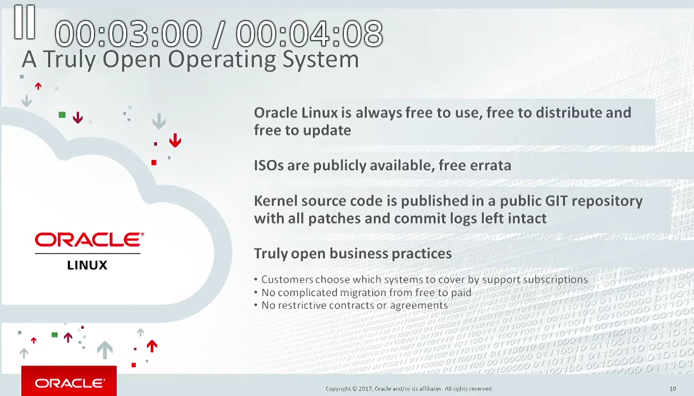
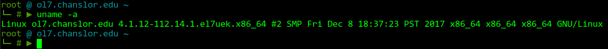

# How I made bcc eBPF tools work on ol7 - Oracle Linux 7

Thanks @brendangregg for the countless hours and excellent videos he has produced on getting us away from Solaris tracing to Linux tracing!
And thank you @hydandata for the Centos7 example that got me started.

I've started using ol ( Oracle Linux ) a lot more since this statement was made by Oracle:
<p align="center">
  
</p>`

# After downloading the 7.4 .iso from [Oracle], my default kernel was 4.1



Check your default kernel
```bash
uname -a
```

Oracle Linux 7.4 .iso came with the [kernel-uek] as default

Make sure your system is up to date
```bash
yum -y update
```

Remove all 3.10 kernels
```bash
yum remove kernel-3.10.0-693 kernel-tools-libs-3.10.0 kernel-3.10.0 kernel-tools-3.10.0
```

Add in 4 kernels
```bash
yum -y install kernel-uek-devel
```

Install EPEL
```bash
RHEL 7 / Centos 7 / OL 7
rpm -ivh https://dl.fedoraproject.org/pub/epel/epel-release-latest-7.noarch.rpm
```

Install developer tools
```bash
yum -y groupinstall "Development tools"
yum install -y elfutils-libelf-devel iperf cmake3
```

Setup your build environment
```bash
export BUILD_DIR="$HOME/build"
```

Install newer version of bison
```bash
#TODO - put in .spec to build rpm
cd $BUILD_DIR
curl -OL https://ftp.gnu.org/gnu/bison/bison-3.0.tar.xz
tar -xf bison-3.0.tar.xz
cd bison-3.0
./configure
make
make install
yum -y remove bison #Remove the old version
```


IMPORT "The Community Enterprise Linux Repository" 
```bash
rpm --import https://www.elrepo.org/RPM-GPG-KEY-elrepo.org
rpm -ivh  https://www.elrepo.org/elrepo-release-7.0-2.el7.elrepo.noarch.rpm
enable in /etc/yum.repos.d/
yum install -y kernel-ml kernel-ml-devel
yum install kernel-ml-tools-libs-devel kernel-ml-tools-libs kernel-ml-tools kernel-ml-headers kernel-ml-devel
reboot system
```

Remove all kernel 3.10 entries 
```bash
yum remove kernel-headers-3.10.0
yum remove kernel-tools-libs-3.10.0
yum remove kernel-debug-devel-3.10.0 kernel-devel-3.10.0
yum remove kernel-3.10.0-693.el7.x86_64 kernel-3.10.0-693.11.1.el7.x86_64

#Then I had to re-install gcc:
yum -y install gcc gcc-c++ gcc-gfortran glibc-devel glibc-headers
```


Install PLY
```bash
#TODO - put in .spec to build rpm
cd $BUILD_DIR
git clone https://github.com/iovisor/ply.git
cd ply
./autogen.sh
./configure
make
make install
```


Install CFE and LLVM
```bash
#TODO - put in .spec to build rpm
cd $BUILD_DIR
curl -LO http://releases.llvm.org/3.9.1/cfe-3.9.1.src.tar.xz
curl -LO http://releases.llvm.org/3.9.1/llvm-3.9.1.src.tar.xz
tar -xf cfe-3.9.1.src.tar.xz
tar -xf llvm-3.9.1.src.tar.xz
mkdir clang-build
mkdir llvm-build

cd llvm-build
cmake3 -G "Unix Makefiles" -DLLVM_TARGETS_TO_BUILD="BPF;X86" \
  -DCMAKE_BUILD_TYPE=Release -DCMAKE_INSTALL_PREFIX=/usr ../llvm-3.9.1.src
make
make install


cd ../clang-build
cmake3 -G "Unix Makefiles" -DLLVM_TARGETS_TO_BUILD="BPF;X86" \
  -DCMAKE_BUILD_TYPE=Release -DCMAKE_INSTALL_PREFIX=/usr ../cfe-3.9.1.src
make
make install
```

Finally, Install BCC
```bash
#TODO - put in .spec to build rpm
cd $BUILD_DIR
git clone https://github.com/iovisor/bcc.git
mkdir bcc-build
cd bcc-build
cmake3 -G "Unix Makefiles" -DCMAKE_INSTALL_PREFIX=/usr ../bcc
make
make install
```

[Oracle]: http://www.oracle.com/technetwork/server-storage/linux/downloads/index.html
[kernel-uek]: http://www.oracle.com/technetwork/server-storage/linux/technologies/uek-overview-2043074.html
